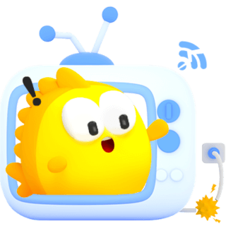

<div align="center">
  
  <h1>Goofish Client</h1>
  <p>一个非官方的闲鱼客户端库，支持商品搜索等功能。</p>
</div>

<div align="center">

[](https://www.npmjs.com/package/goofish-client) [](https://www.npmjs.com/package/goofish-client) [](https://github.com/11273/goofish-client) [](https://github.com/11273/goofish-client/pulls) [](https://github.com/11273/goofish-client)

[](https://github.com/11273/goofish-client/blob/main/LICENSE) [](https://github.com/11273/goofish-client) [](https://github.com/11273/goofish-client) [](https://github.com/11273/goofish-client) [](https://bundlephobia.com/package/goofish-client)

</div>

## ⚠️ 免责声明

**本项目仅供学习和研究目的使用。**

本库为第三方开发的非官方客户端，与闲鱼平台无任何关联。使用本库需注意：

- 合规性风险：请确保您的使用符合相关平台的服务条款及适用法律法规
- 稳定性风险：非官方实现可能随时失效，不保证功能的持续可用性
- 使用风险：使用本库产生的任何后果由使用者自行承担
  本项目开发者不对使用本库产生的任何直接或间接后果负责。请谨慎评估风险后使用。

<div align="center">

📚 **[完整在线文档](https://11273.github.io/goofish-client/)** | 🚀 **[快速开始](#-quick-start)** | 📖 **[API 参考](#-api-reference)**

</div>

</div>

## 📋 Requirements

- **Node.js** >= 14.0.0
- **TypeScript** >= 4.5.0 (可选)
- 支持 ES2020+ 或 CommonJS

## 📦 Installation

```bash
npm install goofish-client
```

**选择你喜欢的包管理器：**

```bash
# NPM
npm install goofish-client

# Yarn
yarn add goofish-client

# PNPM
pnpm add goofish-client
```

## 🚀 Quick Start

### 基本用法

```typescript
import { Goofish, LogLevel } from "goofish-client";

// 1. 创建客户端实例
const client = new Goofish({
  cookie: "cookie2=xxxx", // 你的登录凭证
  level: LogLevel.INFO, // 可选：设置日志级别
});

// 2. 搜索商品
const results = await client.api.mtop.search.search({
  keyword: "iPhone", // 搜索关键词
  pageNumber: 1, // 页码
  rowsPerPage: 20, // 每页数量
});

// 3. 处理结果
if (results.ret[0] === "SUCCESS::调用成功") {
  console.log(`找到 ${results.data.resultList.length} 个商品`);
  results.data.resultList.forEach((item) => {
    const info = item.data.item.main.exContent;
    console.log(`${info.title} - ${info.price.map((p) => p.text).join("")}`);
  });
}
```

### 二维码登录示例

```typescript
import { Goofish, QRCodeStatus } from "goofish-client";

const client = new Goofish();

// 生成二维码
const qrResult = await client.api.passport.qr.generate();
console.log("请扫描二维码:", qrResult.content.data.codeContent);

// 轮询等待确认
const { t, ck } = qrResult.content.data;
while (true) {
  await new Promise((resolve) => setTimeout(resolve, 3000));
  const status = await client.api.passport.qr.query({ t, ck });

  if (status.content.data.qrCodeStatus === QRCodeStatus.CONFIRMED) {
    // 登录成功，更新cookie
    const cookie = client.getCookiePassport();
    client.updateCookieMtop(cookie);
    break;
  }
}
```

## 📝 Logging

### 日志配置

Client 内置了完整的日志系统，支持请求响应日志记录：

```typescript
// 启用调试模式，查看详细的请求响应日志
const client = new Goofish({
  cookie: "cookie2=xxxx",
  level: LogLevel.DEBUG, // 启用后会显示详细的HTTP请求日志
});

// 普通模式，只显示基本信息
const client = new Goofish({
  cookie: "cookie2=xxxx",
  level: LogLevel.WARN, // 默认值，只显示基本日志
});
```

### 日志级别

- `LogLevel.ERROR` (0) - 只显示错误
- `LogLevel.WARN` (1) - 显示警告和错误
- `LogLevel.INFO` (2) - 显示信息、警告和错误
- `LogLevel.DEBUG` (3) - 显示所有日志

### 调试模式

设置日志级别为 `LogLevel.DEBUG` 即可启用详细的调试信息：

- 显示完整的请求 URL、方法、数据
- 显示详细的响应内容
- 显示请求耗时
- 自动过滤敏感信息（如 Cookie、Token 等）

## 📖 API Reference

### 核心方法

<div align="center">

| 方法                                 | 描述           | 返回类型                    |
| ------------------------------------ | -------------- | --------------------------- |
| `client.api.mtop.search.search()`    | 搜索商品       | `Promise<SearchResponse>`   |
| `client.api.mtop.user.getUserHead()` | 获取用户信息   | `Promise<UserResponse>`     |
| `client.api.passport.qr.generate()`  | 生成登录二维码 | `Promise<QRResponse>`       |
| `client.api.passport.qr.query()`     | 查询二维码状态 | `Promise<QRStatusResponse>` |

</div>

### 配置选项

```typescript
interface GoofishConfig {
  cookie?: string; // 登录凭证
  level?: LogLevel; // 日志级别: ERROR, WARN, INFO, DEBUG
  mtop?: {
    timeout?: number; // 请求超时时间 (ms)
    baseURL?: string; // 自定义API地址
  };
  headers?: {
    userAgent?: string; // 自定义User-Agent
  };
}
```

### 搜索参数

```typescript
interface SearchOptions {
  keyword: string; // 搜索关键词 (必需)
  pageNumber?: number; // 页码，默认: 1
  rowsPerPage?: number; // 每页数量，默认: 30
  sortField?: SortField; // 排序字段: PRICE, CREATE, POSITION
  sortValue?: SortValue; // 排序方式: ASC, DESC
  gps?: GPSCoordinate; // GPS坐标
  filter?: {
    priceRange?: {
      // 价格筛选
      from: number;
      to?: number;
    };
    publishDays?: PublishDays; // 发布时间: "1", "3", "7", "14"
    quickFilters?: QuickFilter[]; // 快速筛选: PERSONAL, FREE_POSTAGE 等
  };
}
```

## 📚 More Resources

<div align="center">

| 资源            | 描述                      | 链接                                                                      |
| --------------- | ------------------------- | ------------------------------------------------------------------------- |
| 📖 **在线文档** | 完整的 API 参考和使用指南 | [GitHub Pages](https://11273.github.io/goofish-client/)                   |
| 💻 **示例代码** | 完整的使用示例            | [examples/](./examples/)                                                  |
| 🐛 **问题反馈** | Bug 报告和功能请求        | [GitHub Issues](https://github.com/11273/goofish-client/issues)           |
| 💬 **讨论交流** | 社区讨论和帮助            | [GitHub Discussions](https://github.com/11273/goofish-client/discussions) |

</div>

### 🤝 Contributing

欢迎贡献代码！请查看 [Contributing Guide](https://github.com/11273/goofish-client/blob/main/CONTRIBUTING.md) 了解详情。

### 💡 使用技巧

<details>
<summary><strong>🔧 TypeScript 类型</strong></summary>

```typescript
import type { SearchOptions, SearchResponse } from "goofish-client";
import { SortField, SortValue } from "goofish-client";

const searchOptions: SearchOptions = {
  keyword: "iPhone",
  sortField: SortField.PRICE,
  sortValue: SortValue.ASC,
  filter: {
    priceRange: { from: 1000, to: 5000 },
  },
};
```

</details>

<details>
<summary><strong>🌐 环境支持</strong></summary>

- ✅ **Node.js** - 服务端应用
- ✅ **Browser** - 浏览器环境 (需处理跨域)
- ✅ **Electron** - 桌面应用
- ✅ **React Native** - 移动应用
- ✅ **Next.js** - 全栈框架
- ✅ **Nuxt.js** - Vue 全栈框架

</details>

## 👥 Contributors

<div align="center">

<a href="https://github.com/11273/goofish-client/graphs/contributors">
  
</a>

</div>

## 📊 GitHub Stats

<div align="center">

[](https://github.com/11273/goofish-client)

</div>

## ⭐ Star History

<div align="center">

<a href="https://github.com/11273/goofish-client">
 <picture>
   <source media="(prefers-color-scheme: dark)" srcset="https://api.star-history.com/svg?repos=11273/goofish-client&type=Date&theme=dark" />
   <source media="(prefers-color-scheme: light)" srcset="https://api.star-history.com/svg?repos=11273/goofish-client&type=Date" />
   
 </picture>
</a>

</div>

## 📄 License

<div align="center">
  
  **GPL-3.0 License**
  
  Copyright © 2025 [11273](https://github.com/11273)

</div>
